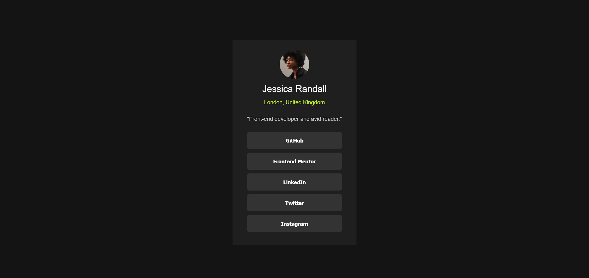

# Frontend Mentor - Social links profile solution

This is a solution to the [Social links profile challenge on Frontend Mentor](https://www.frontendmentor.io/challenges/social-links-profile-UG32l9m6dQ). Frontend Mentor challenges help you improve your coding skills by building realistic projects. 

## Table of contents

- [Overview](#overview)
  - [The challenge](#the-challenge)
  - [Screenshot](#screenshot)
  - [Links](#links)
- [My process](#my-process)
  - [Built with](#built-with)
  - [What I learned](#what-i-learned)
  - [Continued development](#continued-development)
  - [Useful resources](#useful-resources)
- [Author](#author)
- [Acknowledgments](#acknowledgments)

## Overview

### The challenge

Users should be able to:

- See hover and focus states for all interactive elements on the page

### Screenshot

### Links

- Solution URL: [Add solution URL here](https://your-solution-url.com)
- Live Site URL: [Add live site URL here](https://your-live-site-url.com)

## My process

### Built with

- Semantic HTML5 markup
- CSS custom properties
- Flexbox
- Mobile-first workflow

### What I learned

I learned the importance and usage of `body {height : 100vh}`

### Continued development

I want to learn more about variable fonts and typography overall.

### Useful resources

- [ChatGPT](https://www.chatgpt.com) - It's the ultimate debugger especially when there are time constraints.

- [MDN](https://developer.mozilla.org/en-US/) - Very helpful when I get confused or not sure about certain properties and rules.

- [Stack Overflow](https://stackoverflow.com/) - I took help from here when my body got a scrollbar. 

## Author

- Website - [Ajinkya Kinhikar](https://www.kinhikar.com)
- Frontend Mentor - [@kinlearn](https://www.frontendmentor.io/profile/kinlearn)
- Twitter - [@KinLearns](https://www.x.com/KinLearns)

## Acknowledgments

Thanks to [Fronend Mentor](www.frontendmentor.io), [GitHub](www.github.com), [Netlify](https://www.netlify.com/), [CodePen](www.codepen.io), and all the amazing teachers out there for providing me an opportunity to learn and practice the skills completely freely! Thank you so much everyone! 
